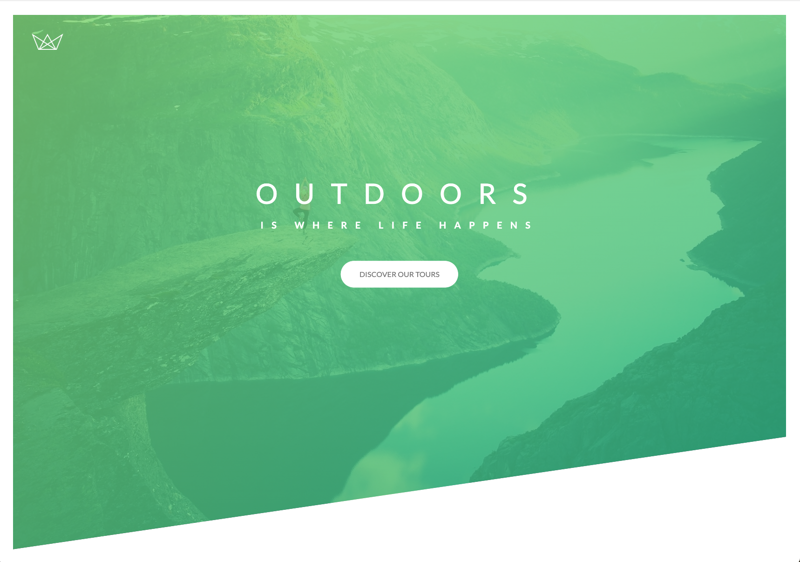

# Advanced CSS 

**Udemy Course:** Advanced CSS and Sass: Flexbox, Grid, Animations and More! 

**Teacher:** Jonas Schmedtmann

## Components

* Header
- default CSS styling 
- box-sizing: border-box
- add font styling to the body 
- background image and gradient colours
- clip-path - adding a wedge (the slant to the bottom of the image)
- SEO optimisation with H1 / Span to styling within the inline element
- display: block 
- centering text-box
- entrance annimation using keyframes 
- animation timing function
- animated button with shadow effect

