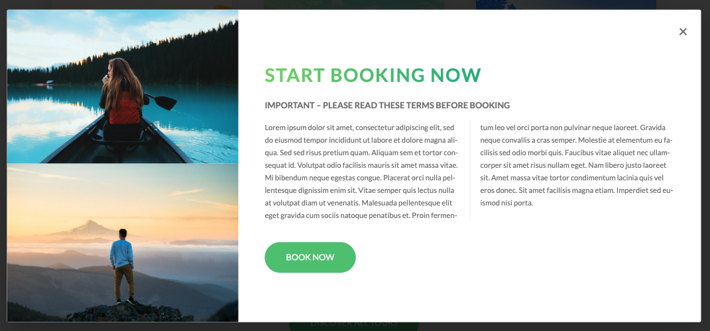

# Advanced CSS 

**Udemy Course:** Advanced CSS and Sass: Flexbox, Grid, Animations and More! 

**Teacher:** Jonas Schmedtmann

## Components

**Header**
- default CSS styling 
- box-sizing: border-box
- add font styling to the body 
- background image and gradient colours
- clip-path - adding a wedge (the slant to the bottom of the image)
- SEO optimisation with H1 / Span to styling within the inline element
- display: block 
- centering text-box
- entrance annimation using keyframes 
- animation timing function
- animated button with shadow effect


____

**About Section**
- use ``<main>`` and then add ``<section>``
- webkit background-clip for the ``<h2>`` text with a gradient and shadow. 
- transform to skew text on hove

Files located under /_typography.scss

**note:**
Need to add color: transparent, otherwise it won’t work. 

- Adding utlity classes to the utility folder, such as consistant margin bottom
- using &not:(last-child) to remove a style


- Learn More button with text-decoration on hover with a shadow


____

**Feature Section** 

- skewed background image 


- gradient colour for the icons 
- hover on grads
- use of grid system to display the cards 


____

**Tours Section**

- Rotating Card (front/ back)
- reusable components (heading and buttons)


____

**Stories Section**

- video as a background
- figcaption for images 
- hover and blur images to display name
- reusable components - buuttons


____

**Booking Section**

- gradient colour for the background image
- custom field placeholder and input 
- booking form 
- custom input field selectors


____

**Footer**

- footer section with links
- link styling


____

**Navigation**

There is a lot going on in this navigation. 

Navigation Hamburger

* Stays in the same place
* Hover on hamburger a css effect
* Click on hamburger turns it into an x
* Expands into navigation, coming in from the left side 
* However over links a CSS effect


____

**Pop Up**

- Pop up created with CSS
- Fixed position, scrollable background
- Images display using table 
- Functionality: open/ close 



____

## Media Queries

Note: this website was originally build desktop first, with max-width media queries.

Located in mixins ``NatoursProject/sass/abstracts/_mixins.scss``

```
0 - 600px:      Phone
600 - 900px:    Tablet portrait
900 - 1200px:   Tablet landscape
[1200 - 1800] is where our normal styles apply
1800px + :      Big desktop

$breakpoint arguement choices:
- phone
- tab-port
- tab-land
- big-desktop
```

em not rem's.

em are best for media query
1em = 16px


____

## SASS Script

* Folder: sass / main.scss
* package.json file, added a script to run compile sass


* To run

``npm run compile:sass``

* This compiles into Folder: css / style.css 

**Note**
1. Add the -w to the end of the script to watch the file 
2. ``npm install live-server`` : reloads the site automatically (install globally on computer) 

___

## Practice 

1. 7-1 CSS Architecture


2. BEM - Block Element Modifier (Naming classes)

**BLOCK:** standalone component that is meaningful on its own

**ELEMENT:** part of a block that has no standalone meaning

**MODIFIER:** a different version of a block or an element


